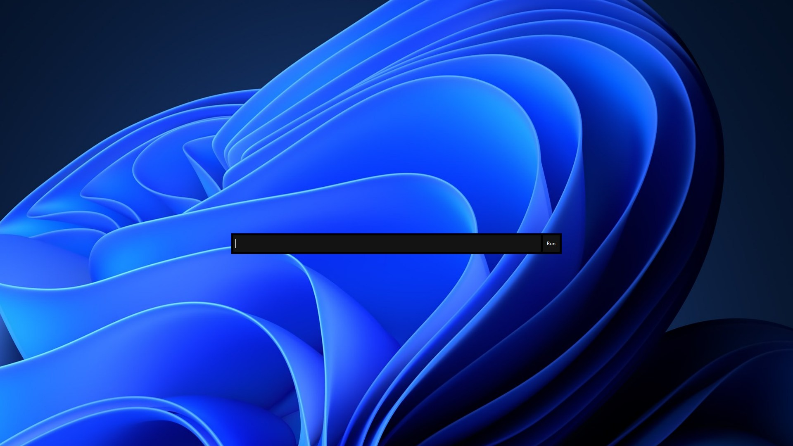
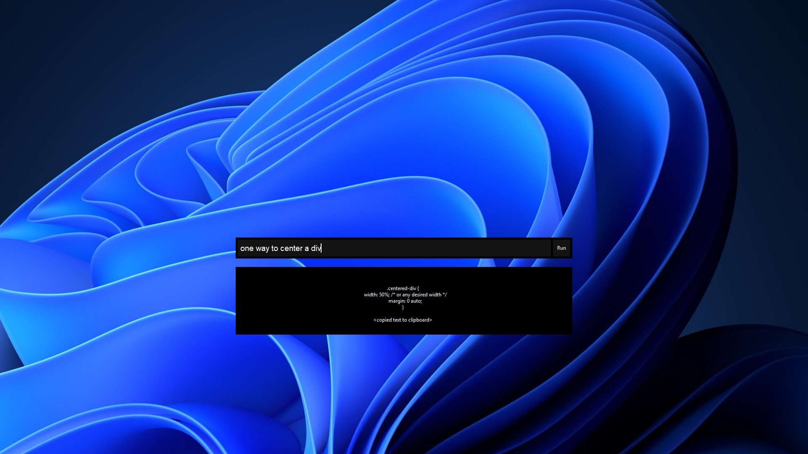

<h1 align="center"">Nova Bot</h1>

Python Desktop AI Assistant

  
  

> This project is very early in development

## Brief Description

    <strong>Nova Bot</strong> is an AI Desktop Assistant, built with python.
    With Nova Bot, you can have a fast AI chatbot multi tool at 
    your fingertips. One useful feature is automatically copying

 
The default keyboard shortcut to open the Command Bar is `Ctrl+Shift+Space`

## AI Features

- Open links
- Type text
- Decide to remember information

## Commands

- `/exit` - Exits Nova Bot
- `/clrmsg` - Clears message history from current Chat Session

## Screenshots

>## DISCLAIMER
> This is my first personal project that I have actually put time into. 
> I am very new to Python so please do not expect anything amazing. 
> This is nowhere near perfect and the code is very unorganized. 
> 
> **Still, you so much for looking at my project :)**
